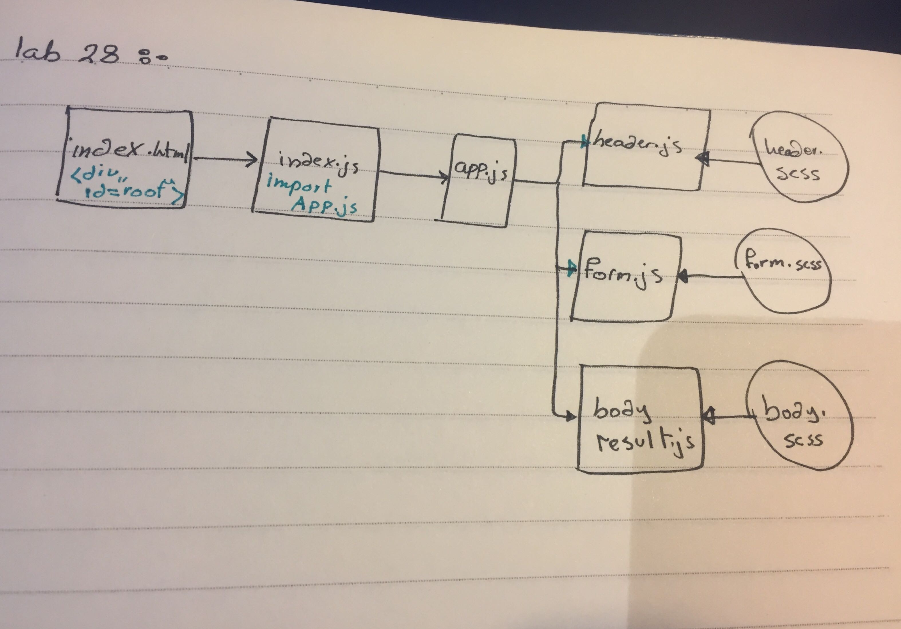

# RESTy

## lab-28 Props and State

### Author: As-har oran

### Links and Resources
* [submission PR]()
### tree for src
```
├── app.js
├── component
│   ├── body
│   │   ├── body.js
│   │   └── body.scss
│   ├── form
│   │   ├── form.js
│   │   └── form.scss
│   └── header
│       ├── header.js
│       └── header.scss
└── index.js
```

#### How to initialize/run your server app (where applicable)
* `npm run start`
  
#### Tests
* `npm test`

#### UML 
* UML Lab-28 : 